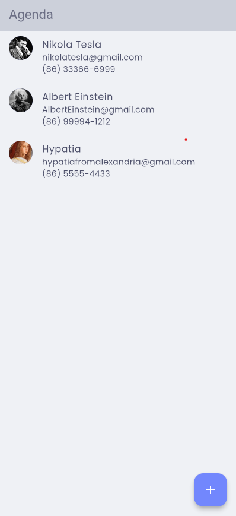
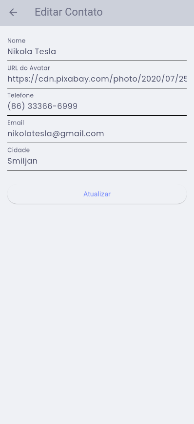
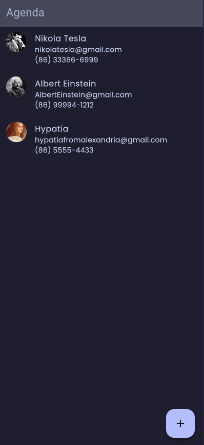
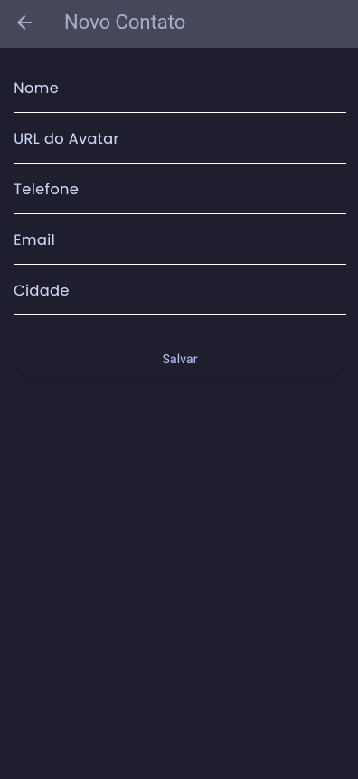
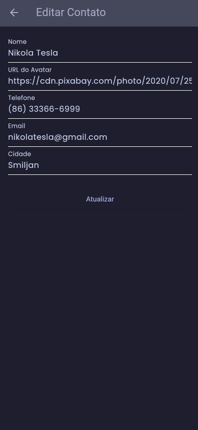

# 📱 Contacts App

Um aplicativo de agenda de contatos moderno e elegante desenvolvido em Flutter, com uma arquitetura limpa e design responsivo.

## 📸 Screenshots

<div align="center">
  
  
  
</div>

<div align="center">
   
  
  
</div>


## ✨ Funcionalidades

- 📋 **Listar Contatos**: Visualize todos os seus contatos em uma lista organizada
- ➕ **Adicionar Contatos**: Crie novos contatos com informações completas
- ✏️ **Editar Contatos**: Atualize as informações dos contatos existentes
- 🗑️ **Excluir Contatos**: Remova contatos com gesto de deslizar (swipe)
- 🔄 **Sincronização**: Integração com API REST para persistência de dados
- 🎨 **Tema Personalizado**: Interface moderna com temas claro e escuro
- 📞 **Formatação de Telefone**: Formatação automática para números brasileiros
- ✉️ **Validação de Email**: Validação de endereços de email

## 🏗️ Arquitetura

Este projeto segue a arquitetura oficialmente recomendada pela equipe do Flutter, separando a aplicação em duas camadas principais: UI Layer e Data Layer.

```
lib/
├── data/                    # 📊 DATA LAYER
│   ├── repository/          # Repositórios (fonte da verdade)  
│   └── service/             # Serviços de API e dados externos
├── domain/                  # 🎯 DOMAIN ENTITIES
│   └── contact.dart         # Entidades do domínio
├── ui/                     # 🎨 UI LAYER
│   ├── contacts/
│   │   ├── viewmodel/      # ViewModels (gerenciam estado da UI)
│   │   └── widgets/        # Views (exibem estado da UI)
│   └── core/              # Temas e componentes base
└── main.dart              # Ponto de entrada
```

### Camadas da Arquitetura Flutter

**Data Layer** - Interage com APIs e fontes de dados externas:
- **Services**: Fazem requisições HTTP e gerenciam dados externos
- **Repositories**: Fonte da verdade dos dados da aplicação e contêm lógica relacionada aos dados

**UI Layer** - Exibe dados ao usuário e gerencia interações:
- **Views**: Widgets que exibem o estado da UI (ContactsScreen, ContactFormScreen)
- **ViewModels**: Gerenciam o estado da UI e fazem a ponte com a Data Layer

**Domain**: Entidades e modelos de dados que representam os conceitos do negócio

## 🛠️ Tecnologias Utilizadas

- **Flutter** - Framework de desenvolvimento mobile
- **Provider** - Gerenciamento de estado
- **HTTP** - Requisições para API REST
- **Flutter DotEnv** - Gerenciamento de variáveis de ambiente
- **Flutter Multi Formatter** - Formatação de campos de entrada
- **Google Fonts** - Tipografia personalizada

## 📋 Pré-requisitos

- Flutter SDK (versão 3.0 ou superior)
- Dart SDK
- Android Studio / VS Code
- Emulador Android ou dispositivo físico

## 🚀 Como Executar

### 1. Clone o repositório
```bash
git clone https://github.com/seu-usuario/contacts_app.git
cd contacts_app
```

### 2. Instale as dependências
```bash
flutter pub get
```

### 3. Configure as variáveis de ambiente
Crie um arquivo `.env` na raiz do projeto:
```env
API_BASE_URL=https://sua-api.com/contacts
```

### 4. Execute o aplicativo
```bash
flutter run
```

## 📦 Dependências

```yaml
dependencies:
  flutter:
    sdk: flutter
  provider: ^6.0.5
  http: ^0.13.5
  flutter_dotenv: ^5.0.2
  flutter_multi_formatter: ^2.11.13
  google_fonts: ^4.0.4
```

## 🎨 Design System

O aplicativo utiliza um sistema de design consistente com:

- **Paleta de Cores**: Baseada no Catppuccin color scheme
- **Tipografia**: Google Fonts (Poppins)
- **Componentes**: Material Design 3
- **Responsividade**: Adaptável a diferentes tamanhos de tela

### Cores Principais

#### Tema Claro
- Primary: `#7287fd`
- Secondary: `#1e66f5`
- Surface: `#eff1f5`
- Error: `#d20f39`

#### Tema Escuro
- Primary: `#b4befe`
- Secondary: `#89b4fa`
- Surface: `#1e1e2e`
- Error: `#f38ba8`

## 🔄 Funcionalidades da API

O aplicativo consome uma API REST com os seguintes endpoints:

- `GET /contacts` - Listar todos os contatos
- `POST /contacts` - Criar novo contato
- `PUT /contacts/{id}` - Atualizar contato
- `DELETE /contacts/{id}` - Excluir contato

### Estrutura do Contato

```json
{
  "id": "string",
  "name": "string",
  "avatar": "string",
  "phoneNumber": "string",
  "email": "string",
  "cityName": "string"
}
```


